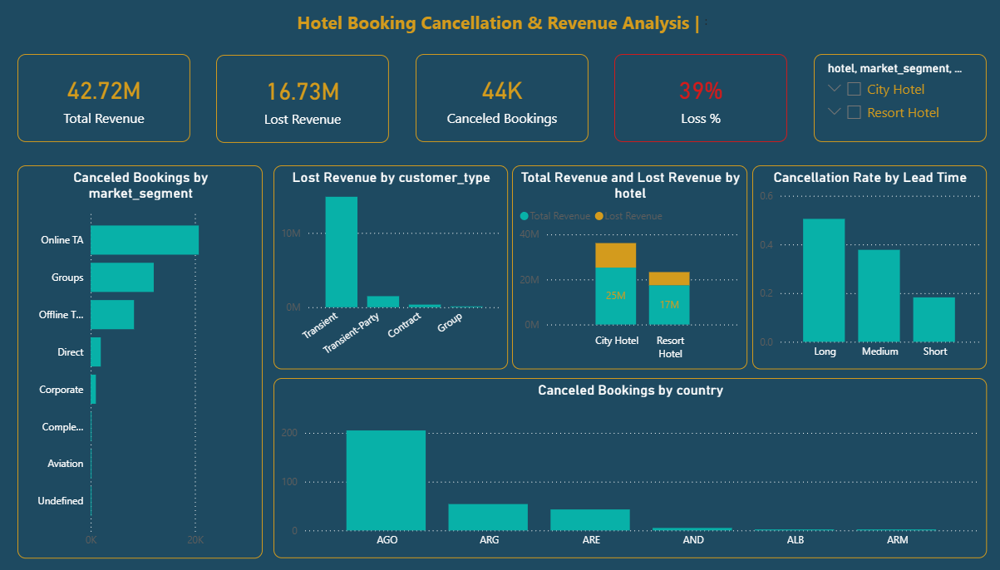

# 📊 Hotel Booking Cancellation & Revenue Analysis

## 🧠 Problem Statement

Hotel bookings cancellations can lead to significant revenue loss.
This project aims to analyze booking behavior, identify key drivers of cancellations, and quantify their financial impact.

---

## 🎯 Objectives

* Analyze cancellation patterns
* Measure revenue loss due to cancellations
* Identify high-risk customer segments and booking channels

---

## 📊 Dashboard Overview

The dashboard provides a clear view of:

* Total Revenue vs Lost Revenue
* Cancellation Rate
* Revenue distribution across segments
* Customer behavior insights

---

## 💡 Key Insights

* **Online Travel Agencies (Online TA)** generate the highest revenue loss
* **Long lead time bookings** are more likely to be canceled
* **Transient customers** contribute the most to cancellations

---

## 💰 Business Impact

Cancellations are not just operational events — they directly affect profitability.
This analysis helps businesses:

* Reduce revenue loss
* Improve booking strategies
* Target high-risk segments more effectively

---

## 🛠 Tools & Technologies

* Power BI
* Power Query
* DAX

---

## 📂 Dataset Description

The dataset includes:

* Booking details (dates, duration, lead time)
* Customer information (type, country)
* Financial metrics (ADR, revenue)
* Booking status (canceled / not canceled)

---

## 📸 Dashboard Preview

---

## 📈 Key Metrics

* Total Revenue
* Lost Revenue
* Cancellation Rate
* Revenue at Risk

---

## 🚀 What I Learned

* Translating raw data into actionable insights
* Building business-focused dashboards
* Using DAX for real-world KPIs

---

## 📬 Let's Connect

If you have feedback or opportunities, feel free to connect with me on LinkedIn.

